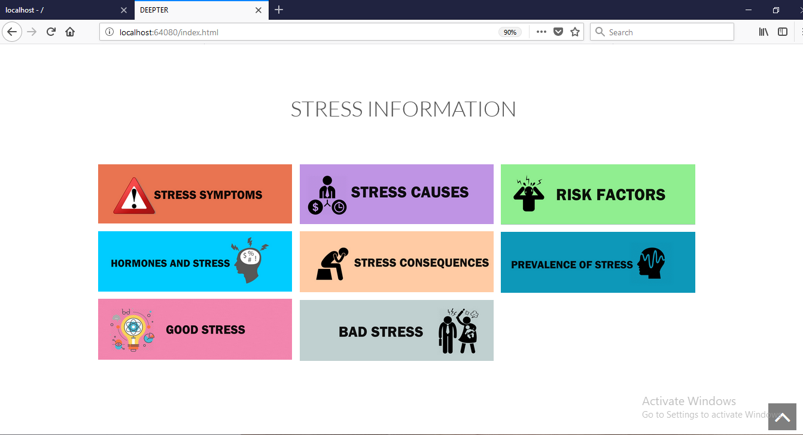
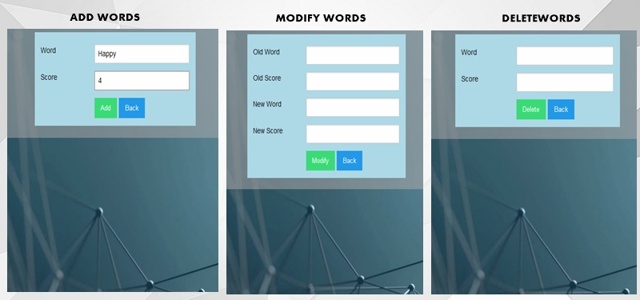
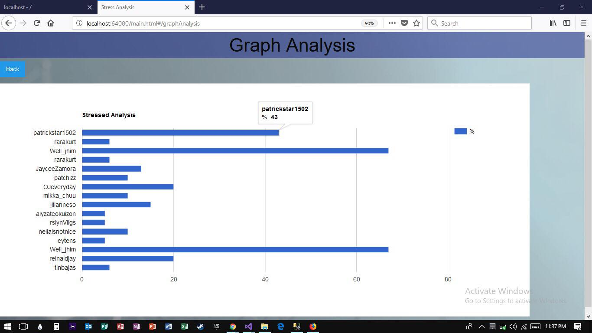

# DEEPTER: Stress Analysis for Twitter Posts Using Natural Language Processing's Technology with Incorporation of Machine Learning Algorithm

The concept of the project is to rate the user’s level of stress via social media with the use Natural Language Processing’s Sentiment Analysis and Information Exctraction Techniques and Support Vector Machine Algorithm for Text Classification

# Project Design

# Screenshots of the System

## Home Page

## Analyze Tweets with Results

### Tweet List

## Stress Info Links

# Admin View

## Contact Link

